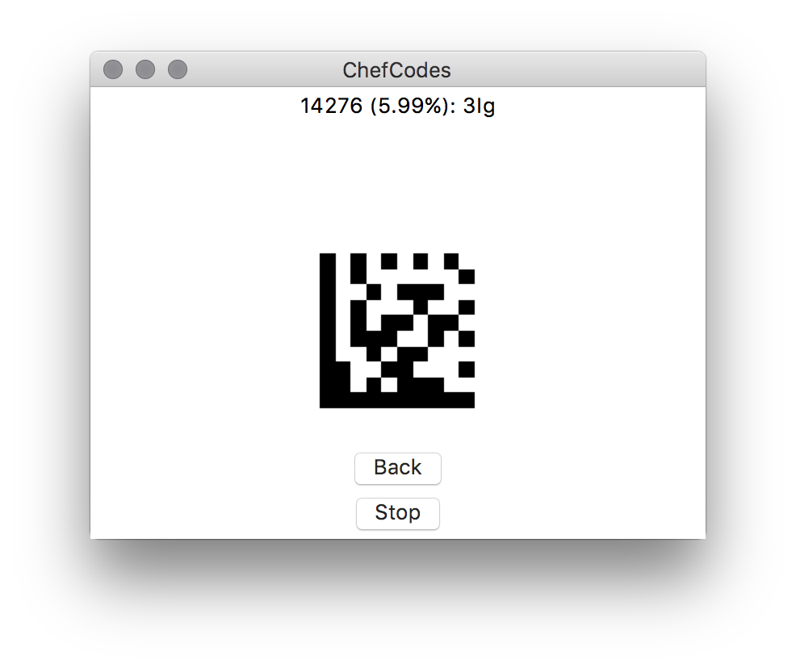
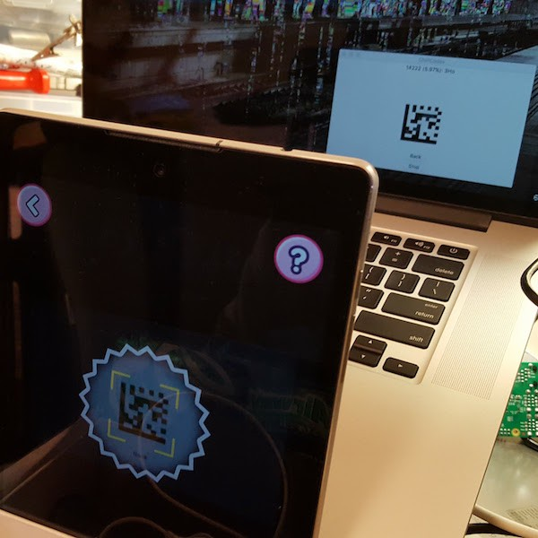

# Introduction

Utility to generate and display Data Matrix barcodes specifically to search for
codes that unlock characters in the app ChefClub.

I don't really know the value of unlocking the characters, that is not so
important to me. When I saw the functionality I assumed it should be possible
to enumerate the code space with some code.

Looking online for some example barcodes and scanned them with a barcode
scanner app to see what value was stored. After trying a few I noticed they use
the format [a-zA-Z0-9]{3} so there isn't THAT difficult to try every
combination. I guess since they have to print the code on small physical toys
they didn't have the luxury to use longer codes with more possible
combinations.

This project is just for fun to try out some things I've not work with much
(barcodes and GUIs). It is hardly practical since the search space contains
over 200,000 codes and the app requires about 1 second to recognise a code. It
would take more than two days to verify every code at best. In reality the
process needs to be monitored by to stop when a code is valid and start again
after clearning the message in the app. Requiring a human operator means it'll
require closer to a week depending on how much time the human can put in.

There are some videos on youtube of people showing off the codes if you are
after them quickly.

# Implementation

A window is displayed on a computer screen that will display codes one after
another, slideshow style. It cycles from 000 to ZZZ. A separate device is
pointed at the computer displaying the codes with the ChefClub app loaded and
in its scanning mode.



The device running the app should be propped up in such a way it can remain
steady and also can be connected to a power supply. Depending on the device,
the scanning function may draw more power than the charger provides, you may
need to apply certain power saving techniques to extend the life per charge.
e.g. reduce the screen brightness, disable unnecessary radios, close background
apps.



[Treepoem](https://pypi.python.org/pypi/treepoem) is used to generate the Data
Matrix barcodes. Treepoem provides a nice wrapper around
[bwipp](https://github.com/bwipp/postscriptbarcode) which does the actual work.

# Installation

If you are on macOS, simply run the following to install requirements:

```
make init
```

Otherwise, install Ghostscript. On Ubuntu/Debian you could use:

```
apt-get install ghostscript
```

Then install python modules:

```
pip install -r requirements.txt
```

# Usage

Run the chef_codes.py script:

```
python3 ./chef_codes.py
```

Prepare your device to point at the center of the window. Click the "Start"
button when ready.

To verify your device can recognise a successful code you can click the "Test"
button. The slideshow will skip ahead to just a few codes before a known valid
code. This should allow you to verify the speed of recognition and your general
setup is ready to begin.

The program will not stop when a valid code is displayed, it has no way to
know. You should click the Stop button when one is displayed to dismiss the
message on the app and perhaps make a note of the code that succeeded before
proceeding.

# Found codes

These are the first few found with the program.

```
Index   Data Value
309     04Z
1289    0kN
4789    1ff
5080    1jW
6828    1M8
7333    1Uh
8424    2bS
8445    2cd
8651    2fx
```
